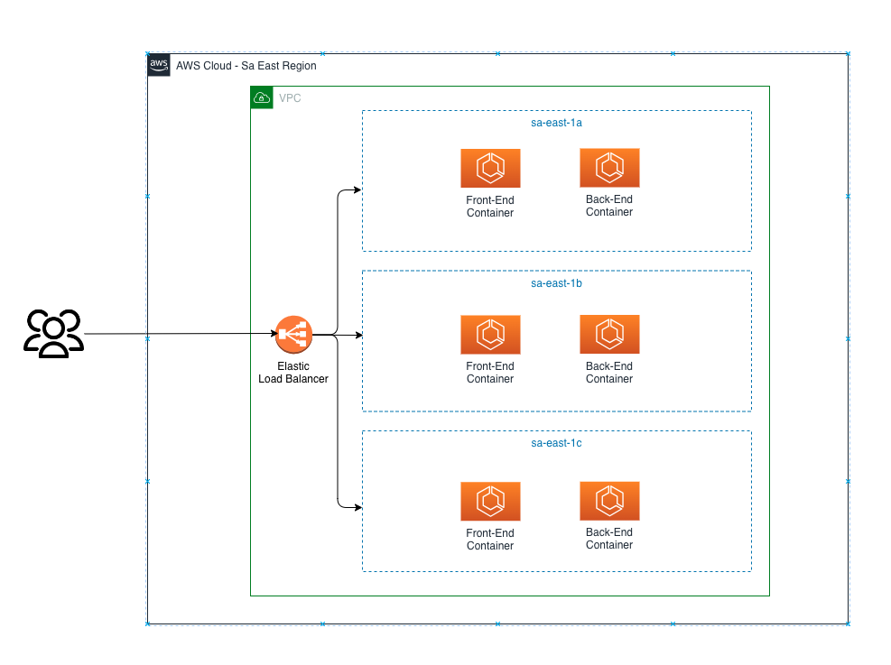

# Albert Einstein Chatbot Challenge

#### Description
This directory comprises the projects:

1. <strong>albert-einstein-chatgpt-api:</strong> Project with the responsibility of consuming the Chatgpt API.
2. <strong>albert-einstein-chatbot-web:</strong> User interface. It will integrate with albert-einstein-chatgpt-api.
For more information, see the README.md at the root of each project.

#### Running the application through docker-compose:
1. Before start up the application with docker-compose, carefully read the instructions in the README.md file of each project!
2. In the root folder, executes the command:
```bash
    docker-compose up -d
```


### Architecture

Considering the Chatbot an MVP, the basic architecture adopted to make the solution available will be:

1. We will have an Elastic Load balancer at the front to route requests to the three available regions;
2. In order to avoid latency problems, the chosen region will be São Paulo (SA-EAST);
3. To ensure self-availability at this first moment, we will have a cluster in three AWS availability zones. The idea is to monitor the application's behavior to collect metrics and identify whether this architecture is sufficient and adequate;
4. For this, we can hire services such as ELK Stack or Amazon OpenSearch on the AWS Marketplace.

<strong> Points of attention: </strong> Single point of failure. We can then think of a solution to remedy this problem, such as Traefik, NGINX, etc.c.

